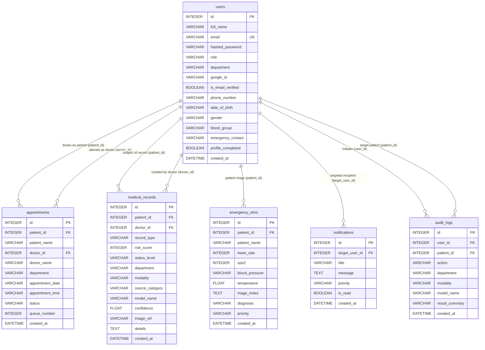

# Entity-Relationship (ER) Diagram

Represents the physical SQLite database schema of `backend/app/aura_health.db`, including all tables, primary keys, foreign keys, columns, and cardinality.

```mermaid
erDiagram
    users ||--o{ appointments : "books as patient (patient_id)"
    users ||--o{ appointments : "attends as doctor (doctor_id)"
    users ||--o{ medical_records : "subject of record (patient_id)"
    users ||--o{ medical_records : "created by doctor (doctor_id)"
    users ||--o{ emergency_ehrs : "patient triage (patient_id)"
    users ||--o{ notifications : "targeted recipient (target_user_id)"
    users ||--o{ audit_logs : "initiator (user_id)"
    users ||--o{ audit_logs : "target patient (patient_id)"

    users {
        INTEGER id PK
        VARCHAR full_name
        VARCHAR email UK
        VARCHAR hashed_password
        VARCHAR role
        VARCHAR department
        VARCHAR google_id
        BOOLEAN is_email_verified
        VARCHAR phone_number
        VARCHAR date_of_birth
        VARCHAR gender
        VARCHAR blood_group
        VARCHAR emergency_contact
        BOOLEAN profile_completed
        DATETIME created_at
    }

    appointments {
        INTEGER id PK
        INTEGER patient_id FK
        VARCHAR patient_name
        INTEGER doctor_id FK
        VARCHAR doctor_name
        VARCHAR department
        VARCHAR appointment_date
        VARCHAR appointment_time
        VARCHAR status
        INTEGER queue_number
        DATETIME created_at
    }

    medical_records {
        INTEGER id PK
        INTEGER patient_id FK
        INTEGER doctor_id FK
        VARCHAR record_type
        INTEGER risk_score
        VARCHAR status_level
        VARCHAR department
        VARCHAR modality
        VARCHAR source_category
        VARCHAR model_name
        FLOAT confidence
        VARCHAR image_ref
        TEXT details
        DATETIME created_at
    }

    emergency_ehrs {
        INTEGER id PK
        INTEGER patient_id FK
        VARCHAR patient_name
        INTEGER heart_rate
        INTEGER spo2
        VARCHAR blood_pressure
        FLOAT temperature
        TEXT triage_notes
        VARCHAR diagnosis
        VARCHAR priority
        DATETIME created_at
    }

    notifications {
        INTEGER id PK
        INTEGER target_user_id FK
        VARCHAR title
        TEXT message
        VARCHAR priority
        BOOLEAN is_read
        DATETIME created_at
    }

    audit_logs {
        INTEGER id PK
        INTEGER user_id FK
        INTEGER patient_id FK
        VARCHAR action
        VARCHAR department
        VARCHAR modality
        VARCHAR model_name
        VARCHAR result_summary
        DATETIME created_at
    }
```
