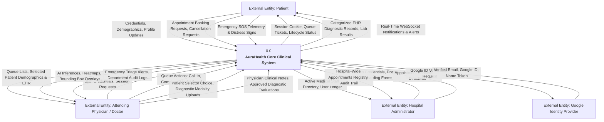

# Data Flow Diagram (DFD) — Level 0 (Context Diagram)

Represents the boundary of the AuraHealth Core System and external entities exchanging clinical, administrative, and diagnostic data flows.

```mermaid
graph TD
    Patient["External Entity: Patient"]
    Doctor["External Entity: Attending Physician / Doctor"]
    Admin["External Entity: Hospital Administrator"]
    Google["External Entity: Google Identity Provider"]
    
    System["0.0<br/><b>AuraHealth Core Clinical System</b>"]

    %% Patient Flows
    Patient -->|Credentials, Demographics, Profile Updates| System
    Patient -->|Appointment Booking Requests, Cancellation Requests| System
    Patient -->|Emergency SOS Telemetry & Distress Signs| System
    System -->|Session Cookie, Queue Tickets, Lifecycle Status| Patient
    System -->|Categorized EHR Diagnostic Records, Lab Results| Patient
    System -->|Real-Time WebSocket Notifications & Alerts| Patient

    %% Doctor Flows
    Doctor -->|Staff Credentials, Session Requests| System
    Doctor -->|Queue Actions: Call In, Complete, Mark Missed| System
    Doctor -->|Patient Selector Choice, Diagnostic Modality Uploads| System
    Doctor -->|Physician Clinical Notes, Approved Diagnostic Evaluations| System
    System -->|Queue Lists, Selected Patient Demographics & EHR| Doctor
    System -->|AI Inferences, Heatmaps, Bounding Box Overlays| Doctor
    System -->|Emergency Triage Alerts, Department Audit Logs| Doctor

    %% Admin Flows
    Admin -->|Admin Credentials, Doctor Onboarding Forms| System
    Admin -->|Appointment Cancellation Directives| System
    System -->|Active Medical Staff Directory, User Ledger| Admin
    System -->|Hospital-Wide Appointments Registry, Audit Trail| Admin

    %% Google Identity Flows
    System -->|Google ID Verification Request| Google
    Google -->|Verified Email, Google ID, Name Token| System
```
