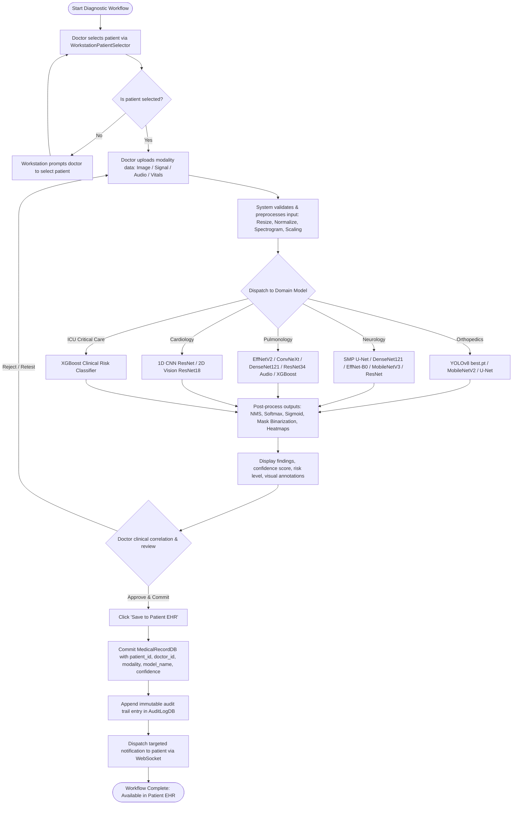

# Activity Diagram — AI Diagnostic Inference & EHR Persistence

Illustrates the clinical workflow from patient identification through multimodal AI evaluation, review, and EHR commitment.

```mermaid
flowchart TD
    Start([Start Diagnostic Workflow]) --> SelectPatient[Doctor selects patient via WorkstationPatientSelector]
    SelectPatient --> CheckPatientSelected{Is patient selected?}
    
    CheckPatientSelected -- No --> PromptSelect[Workstation prompts doctor to select patient]
    PromptSelect --> SelectPatient
    
    CheckPatientSelected -- Yes --> IngestModality[Doctor uploads modality data: Image / Signal / Audio / Vitals]
    IngestModality --> Preprocess[System validates & preprocesses input: Resize, Normalize, Spectrogram, Scaling]
    Preprocess --> DispatchModel{Dispatch to Domain Model}
    
    DispatchModel -->|Orthopedics| OrthoModel[YOLOv8 best.pt / MobileNetV2 / U-Net]
    DispatchModel -->|Neurology| NeuroModel[SMP U-Net / DenseNet121 / EffNet-B0 / MobileNetV3 / ResNet]
    DispatchModel -->|Pulmonology| RespModel[EffNetV2 / ConvNeXt / DenseNet121 / ResNet34 Audio / XGBoost]
    DispatchModel -->|Cardiology| ECGModel[1D CNN ResNet / 2D Vision ResNet18]
    DispatchModel -->|ICU Critical Care| ICUModel[XGBoost Clinical Risk Classifier]
    
    OrthoModel --> PostProcess[Post-process outputs: NMS, Softmax, Sigmoid, Mask Binarization, Heatmaps]
    NeuroModel --> PostProcess
    RespModel --> PostProcess
    ECGModel --> PostProcess
    ICUModel --> PostProcess
    
    PostProcess --> DisplayFindings[Display findings, confidence score, risk level, visual annotations]
    DisplayFindings --> DoctorReview{Doctor clinical correlation & review}
    
    DoctorReview -- Reject / Retest --> IngestModality
    DoctorReview -- Approve & Commit --> SaveRecord[Click 'Save to Patient EHR']
    
    SaveRecord --> PersistEHR[Commit MedicalRecordDB with patient_id, doctor_id, modality, model_name, confidence]
    PersistEHR --> WriteAudit[Append immutable audit trail entry in AuditLogDB]
    WriteAudit --> DispatchWS[Dispatch targeted notification to patient via WebSocket]
    DispatchWS --> End([Workflow Complete: Available in Patient EHR])
```
