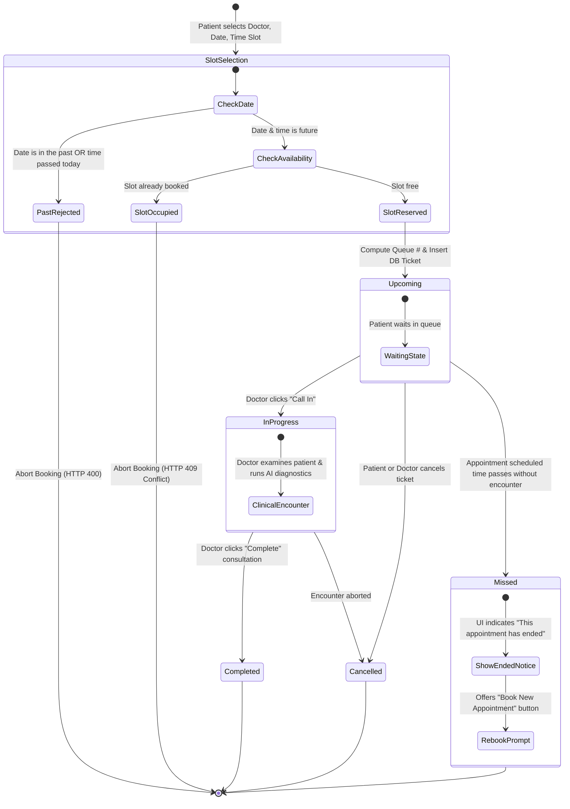

# Activity Diagram — Appointment Scheduling & Lifecycle

Illustrates the complete lifecycle of a clinical consultation ticket, including automated past-slot expiration handling.

```mermaid
stateDiagram-v2
    [*] --> SlotSelection: Patient selects Doctor, Date, Time Slot
    
    state SlotSelection {
        [*] --> CheckDate
        CheckDate --> PastRejected: Date is in the past OR time passed today
        CheckDate --> CheckAvailability: Date & time is future
        CheckAvailability --> SlotOccupied: Slot already booked
        CheckAvailability --> SlotReserved: Slot free
    }

    PastRejected --> [*]: Abort Booking (HTTP 400)
    SlotOccupied --> [*]: Abort Booking (HTTP 409 Conflict)
    
    SlotReserved --> Upcoming: Compute Queue # & Insert DB Ticket
    
    state Upcoming {
        [*] --> WaitingState: Patient waits in queue
    }

    Upcoming --> InProgress: Doctor clicks "Call In"
    Upcoming --> Cancelled: Patient or Doctor cancels ticket
    Upcoming --> Missed: Appointment scheduled time passes without encounter

    state InProgress {
        [*] --> ClinicalEncounter: Doctor examines patient & runs AI diagnostics
    }

    InProgress --> Completed: Doctor clicks "Complete" consultation
    InProgress --> Cancelled: Encounter aborted

    state Missed {
        [*] --> ShowEndedNotice: UI indicates "This appointment has ended"
        ShowEndedNotice --> RebookPrompt: Offers "Book New Appointment" button
    }

    Completed --> [*]
    Cancelled --> [*]
    Missed --> [*]
```
