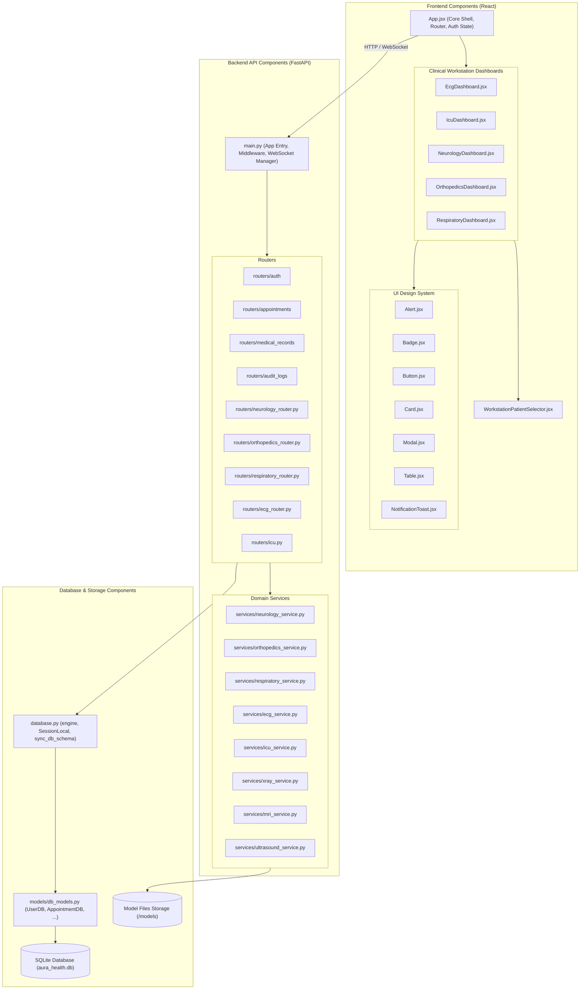

# Component Diagram

Illustrates the structural components across the React frontend client, the FastAPI backend services, and the data layer.

```mermaid
graph TB
    subgraph FrontendComponents["Frontend Components (React)"]
        App["App.jsx (Core Shell, Router, Auth State)"]
        WorkstationSelector["WorkstationPatientSelector.jsx"]
        
        subgraph Dashboards["Clinical Workstation Dashboards"]
            CardioDash["EcgDashboard.jsx"]
            IcuDash["IcuDashboard.jsx"]
            NeuroDash["NeurologyDashboard.jsx"]
            OrthoDash["OrthopedicsDashboard.jsx"]
            RespDash["RespiratoryDashboard.jsx"]
        end
        
        subgraph UIComponents["UI Design System"]
            AlertComp["Alert.jsx"]
            BadgeComp["Badge.jsx"]
            ButtonComp["Button.jsx"]
            CardComp["Card.jsx"]
            ModalComp["Modal.jsx"]
            TableComp["Table.jsx"]
            ToastComp["NotificationToast.jsx"]
        end
    end

    subgraph BackendComponents["Backend API Components (FastAPI)"]
        MainApp["main.py (App Entry, Middleware, WebSocket Manager)"]
        
        subgraph APIRouters["Routers"]
            AuthRouter["routers/auth"]
            ApptRouter["routers/appointments"]
            RecordRouter["routers/medical_records"]
            AuditRouter["routers/audit_logs"]
            NeuroRouter["routers/neurology_router.py"]
            OrthoRouter["routers/orthopedics_router.py"]
            RespRouter["routers/respiratory_router.py"]
            EcgRouter["routers/ecg_router.py"]
            IcuRouter["routers/icu.py"]
        end
        
        subgraph Services["Domain Services"]
            NeuroService["services/neurology_service.py"]
            OrthoService["services/orthopedics_service.py"]
            RespService["services/respiratory_service.py"]
            EcgService["services/ecg_service.py"]
            IcuService["services/icu_service.py"]
            XrayService["services/xray_service.py"]
            MriService["services/mri_service.py"]
            UsService["services/ultrasound_service.py"]
        end
    end

    subgraph DataComponents["Database & Storage Components"]
        DBEngine["database.py (engine, SessionLocal, sync_db_schema)"]
        DBModels["models/db_models.py (UserDB, AppointmentDB, ...)"]
        SQLiteDB[("SQLite Database (aura_health.db)")]
        ModelStorage[("Model Files Storage (/models)")]
    end

    %% Wiring
    App --> Dashboards
    Dashboards --> WorkstationSelector
    Dashboards --> UIComponents
    
    App -->|HTTP / WebSocket| MainApp
    MainApp --> APIRouters
    APIRouters --> Services
    Services --> ModelStorage
    APIRouters --> DBEngine
    DBEngine --> DBModels
    DBModels --> SQLiteDB
```
