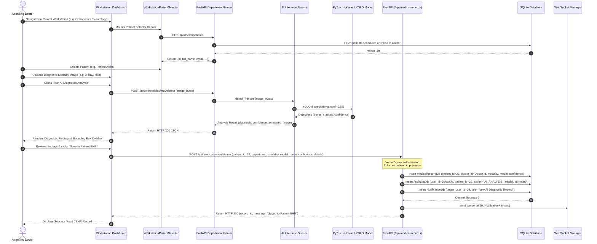

# Sequence Diagram — Doctor AI Analysis & Patient EHR Attribution

Illustrates doctor patient selection, real AI inference execution, patient-specific EHR persistence, and audit log generation.

```mermaid
sequenceDiagram
    autonumber
    actor Doctor as Attending Doctor
    participant UI as Workstation Dashboard
    participant Selector as WorkstationPatientSelector
    participant API as FastAPI Department Router
    participant Service as AI Inference Service
    participant Model as PyTorch / Keras / YOLO Model
    participant EHR_API as FastAPI (/api/medical-records)
    participant DB as SQLite Database
    participant WS as WebSocket Manager

    Doctor->>UI: Navigates to Clinical Workstation (e.g. Orthopedics / Neurology)
    UI->>Selector: Mounts Patient Selector Banner
    Selector->>API: GET /api/doctor/patients
    API->>DB: Fetch patients scheduled or linked to Doctor
    DB-->>API: Patient List
    API-->>Selector: Return [{id, full_name, email, ...}]
    Doctor->>Selector: Selects Patient (e.g. Patient Alpha #29)

    Doctor->>UI: Uploads Diagnostic Modality Image (e.g. X-Ray, MRI)
    Doctor->>UI: Clicks "Run AI Diagnostic Analysis"
    UI->>API: POST /api/orthopedics/xray/detect (image_bytes)
    API->>Service: detect_fracture(image_bytes)
    Service->>Model: YOLOv8.predict(img, conf=0.15)
    Model-->>Service: Detections (boxes, classes, confidence)
    Service-->>API: Analysis Result (diagnosis, confidence, annotated_image)
    API-->>UI: Return HTTP 200 JSON
    UI-->>Doctor: Renders Diagnostic Findings & Bounding Box Overlay

    Doctor->>UI: Reviews findings & clicks "Save to Patient EHR"
    UI->>EHR_API: POST /api/medical-records/save {patient_id: 29, department, modality, model_name, confidence, details}
    
    Note over EHR_API: Verify Doctor authorization<br/>Enforces patient_id presence
    EHR_API->>DB: Insert MedicalRecordDB (patient_id=29, doctor_id=Doctor.id, modality, model, confidence)
    EHR_API->>DB: Insert AuditLogDB (user_id=Doctor.id, patient_id=29, action="AI_ANALYSIS", model, summary)
    EHR_API->>DB: Insert NotificationDB (target_user_id=29, title="New AI Diagnostic Record")
    DB-->>EHR_API: Commit Success (#RecordID, #AuditID)
    
    EHR_API->>WS: send_personal(29, NotificationPayload)
    EHR_API-->>UI: Return HTTP 200 {record_id, message: "Saved to Patient EHR"}
    UI-->>Doctor: Displays Success Toast ("EHR Record #RecordID Saved")
```
