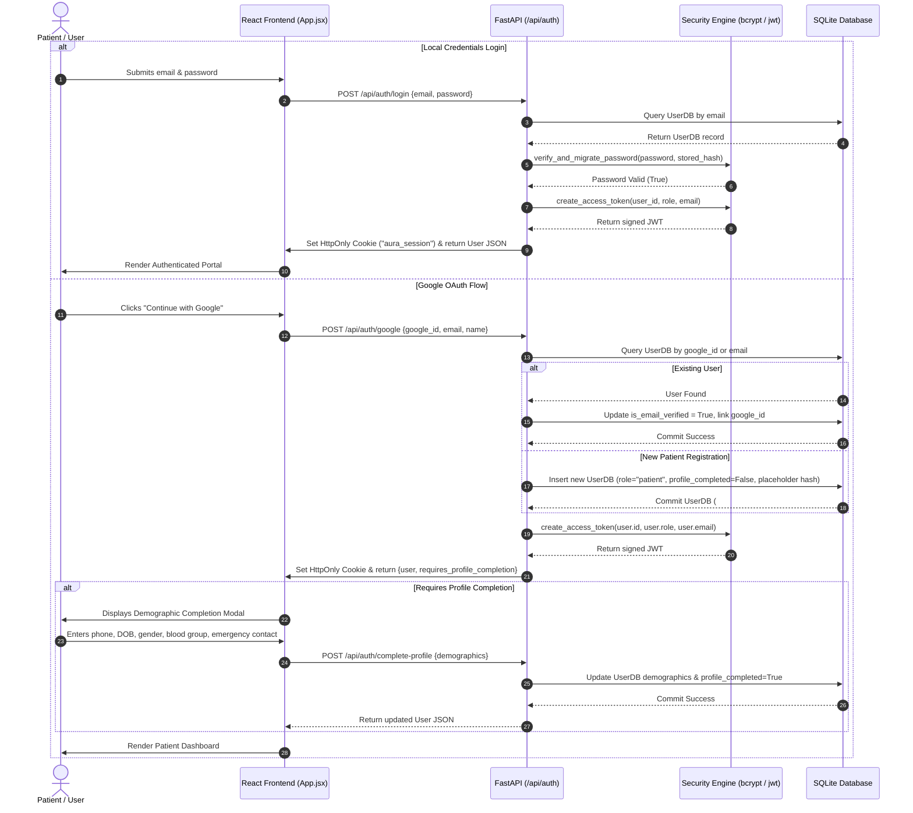

# Sequence Diagram — Patient Authentication & Google Flow

Illustrates both local credential verification and Google authentication flows, including profile completion handling.

```mermaid
sequenceDiagram
    autonumber
    actor User as Patient / User
    participant UI as React Frontend (App.jsx)
    participant AuthRouter as FastAPI (/api/auth)
    participant Sec as Security Engine (bcrypt / jwt)
    participant DB as SQLite Database

    alt Local Credentials Login
        User->>UI: Submits email & password
        UI->>AuthRouter: POST /api/auth/login {email, password}
        AuthRouter->>DB: Query UserDB by email
        DB-->>AuthRouter: Return UserDB record
        AuthRouter->>Sec: verify_and_migrate_password(password, stored_hash)
        Sec-->>AuthRouter: Password Valid (True)
        AuthRouter->>Sec: create_access_token(user_id, role, email)
        Sec-->>AuthRouter: Return signed JWT
        AuthRouter->>UI: Set HttpOnly Cookie ("aura_session") & return User JSON
        UI->>User: Render Authenticated Portal
    else Google OAuth Flow
        User->>UI: Clicks "Continue with Google"
        UI->>AuthRouter: POST /api/auth/google {google_id, email, name}
        AuthRouter->>DB: Query UserDB by google_id or email
        alt Existing User
            DB-->>AuthRouter: User Found
            AuthRouter->>DB: Update is_email_verified = True, link google_id
            DB-->>AuthRouter: Commit Success
        else New Patient Registration
            AuthRouter->>DB: Insert new UserDB (role="patient", profile_completed=False, placeholder hash)
            DB-->>AuthRouter: Commit UserDB (#ID)
        end
        AuthRouter->>Sec: create_access_token(user.id, user.role, user.email)
        Sec-->>AuthRouter: Return signed JWT
        AuthRouter->>UI: Set HttpOnly Cookie & return {user, requires_profile_completion}
        alt Requires Profile Completion
            UI->>User: Displays Demographic Completion Modal
            User->>UI: Enters phone, DOB, gender, blood group, emergency contact
            UI->>AuthRouter: POST /api/auth/complete-profile {demographics}
            AuthRouter->>DB: Update UserDB demographics & profile_completed=True
            DB-->>AuthRouter: Commit Success
            AuthRouter-->>UI: Return updated User JSON
        end
        UI->>User: Render Patient Dashboard
    end
```
