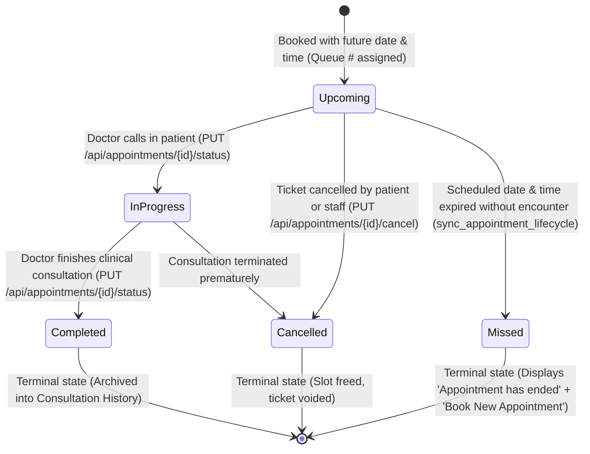

# State Diagram — Appointment Lifecycle States

Illustrates the canonical appointment lifecycle states: `Upcoming`, `In Progress`, `Completed`, `Missed`, and `Cancelled`.

```mermaid
stateDiagram-v2
    [*] --> Upcoming: Booked with future date & time (Queue # assigned)

    Upcoming --> InProgress: Doctor calls in patient (PUT /api/appointments/{id}/status)
    Upcoming --> Cancelled: Ticket cancelled by patient or staff (PUT /api/appointments/{id}/cancel)
    Upcoming --> Missed: Scheduled date & time expired without encounter (sync_appointment_lifecycle)

    InProgress --> Completed: Doctor finishes clinical consultation (PUT /api/appointments/{id}/status)
    InProgress --> Cancelled: Consultation terminated prematurely

    Missed --> [*]: Terminal state (Displays 'Appointment has ended' + 'Book New Appointment')
    Completed --> [*]: Terminal state (Archived into Consultation History)
    Cancelled --> [*]: Terminal state (Slot freed, ticket voided)
```
