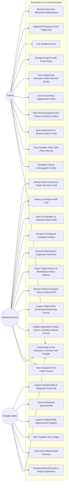

# Use Case Diagram

This diagram represents the actual implemented use cases across the three primary actor roles: **Patient**, **Doctor**, and **Hospital Administrator**.

```mermaid
graph LR
    Patient((Patient))
    Doctor((Attending Doctor))
    Admin((Hospital Admin))

    subgraph AuraHealthSystem["AuraHealth Core Clinical System"]
        %% Patient Use Cases
        UC_P1["Authenticate (Local Password / Continue with Google)"]
        UC_P2["Complete Clinical Demographic Profile"]
        UC_P3["View Available Clinic Slots (Past-Filtered)"]
        UC_P4["Book Appointment & Receive Queue Ticket"]
        UC_P5["View Personal Appointment Tickets & Lifecycle Status"]
        UC_P6["Cancel Upcoming Appointment Ticket"]
        UC_P7["View Categorized Electronic Health Records (EHR)"]
        UC_P8["Manage Email & Verify Email Status"]
        UC_P9["Link Google Account"]
        UC_P10["Dispatch Emergency Acute Triage SOS"]
        UC_P11["Receive Real-Time WebSocket Notifications"]

        %% Doctor Use Cases
        UC_D1["View Assigned Clinic Patient Queue"]
        UC_D2["Update Appointment Status (Call In, Complete, Missed, Cancel)"]
        UC_D3["Inspect Patient EHR (Protected Relationship Check)"]
        UC_D4["Record Clinical Evaluation Note to Patient EHR"]
        UC_D5["Select Target Patient via Workstation Patient Selector"]
        UC_D6["Execute Multimodal AI Diagnostic Inferences"]
        UC_D7["Review AI Findings & Localized Overlays"]
        UC_D8["Save AI Evaluation to Selected Patient EHR"]
        UC_D9["Inspect AI Analysis Audit Trail"]
        UC_D10["Monitor Acute Emergency Triage Telemetry Feed"]

        %% Admin Use Cases
        UC_A1["Onboard Medical Doctor & Assign Department"]
        UC_A2["View Active Medical Staff Directory"]
        UC_A3["View Hospital Users Ledger"]
        UC_A4["Inspect Hospital-Wide Appointments Registry"]
        UC_A5["Cancel Scheduled Appointments"]
        UC_A6["Inspect Hospital-Wide AI Diagnostic Audit Trail"]
    end

    %% Patient Associations
    Patient --> UC_P1
    Patient --> UC_P2
    Patient --> UC_P3
    Patient --> UC_P4
    Patient --> UC_P5
    Patient --> UC_P6
    Patient --> UC_P7
    Patient --> UC_P8
    Patient --> UC_P9
    Patient --> UC_P10
    Patient --> UC_P11

    %% Doctor Associations
    Doctor --> UC_P1
    Doctor --> UC_D1
    Doctor --> UC_D2
    Doctor --> UC_D3
    Doctor --> UC_D4
    Doctor --> UC_D5
    Doctor --> UC_D6
    Doctor --> UC_D7
    Doctor --> UC_D8
    Doctor --> UC_D9
    Doctor --> UC_D10

    %% Admin Associations
    Admin --> UC_P1
    Admin --> UC_A1
    Admin --> UC_A2
    Admin --> UC_A3
    Admin --> UC_A4
    Admin --> UC_A5
    Admin --> UC_A6
```
